# PIC32CXBZ2_WBZ45x_FROM_BLE_SENSOR_TO_PHONE_APP

> "IoT Made Easy!" - Follow Frank, a smart developer, making a BLE sensor based on WBZ45x device with a Phone App and make your own in 30 minutes

Devices: **PIC32CXBZ2 | WBZ45x** 
Features: **BLE | Transparent UART Profile | Smartphone App | Android | MIT App Inventor**

## ⚠ Disclaimer

<b>
THE SOFTWARE ARE PROVIDED "AS IS" AND GIVE A PATH FOR SELF-SUPPORT AND SELF-MAINTENANCE. This repository contains example code intended to help accelerate client product development.  

For additional Microchip repos, see: <a href="https://github.com/Microchip-MPLAB-Harmony" target="_blank">https://github.com/Microchip-MPLAB-Harmony</a>

Checkout the <a href="https://microchipsupport.force.com/s/" target="_blank">Technical support portal</a> to access our knowledge base, community forums or submit support ticket requests.

</b>

## A la carte

1. [Introduction](#step1)
1. [Bill of materials](#step2)
1. [Hardware Setup](#step3)
1. [Software Setup](#step4)
1. [BLE Sensor Application](#step5)
   1. [Part A - Setup the BLE Transparent UART](#step5a) 
   1. [Part B - Setup Timer and LEDs](#step5b)
   1. [Part C - Setup Sensor Interface](#step5c)
   1. [Part D - Finalize Application code](#step5d)
1. [Smartphone Application](#step6)
1. [Run the demo](#step7)

## Introduction

From BLE Sensor to Phone App.

BLE Sensor: 
Its a step by step instructions to create a queue based project using transparent UART in part A. In part B, I added a timer and with a periodic message sent over transparent uart. In part C, I have connected a temperature sensor to WBZ451 Curiosity board and in part D, I provide steps to finalize the application code.

Phone App: 
Its a step by step instructions to create your own Android Application using MIT App Inventor.

## Bill of materials

* [PIC32CX-BZ2-WBZ451-EA Curiosity Board](https://www.microchip.com/en-us/development-tool/EA71C53A)

* [Thermo-8 click](https://www.mikroe.com/thermo-8-click)

* A micro-USB cable

* Smartphone with Android 12 (e.g. Samsung SM-G981B)

## Hardware Setup

* Plug the Thermo-8 click to the WBZ451 Curiosity Board

* Simply plug the WBZ45x Curiosity Board to the computer using a micro-USB cable

## Software Setup

* <a href="https://onlinedocs.microchip.com/pr/GUID-A5330D3A-9F51-4A26-B71D-8503A493DF9C-en-US-1/index.html?GUID-2AD37FE2-1915-4E34-9A05-79E3810726D7" target="_blank">Getting Started with Software Development</a>

## BLE Sensor Application

### Part A - Setup the BLE Transparent UART

I’ve created a BLE Transparent UART project using MPLAB X IDE where I use the Queue as a to do list for the application task. Essentially every event/action is posted to the queue and then the application tasks case: `APP_STATE_SERVICE_TASKS`: takes care of the to do list.

**Step 1** - Setup of files

I started with the building blocks example for <a href="https://github.com/Microchip-MPLAB-Harmony/wireless_apps_pic32cxbz2_wbz45/tree/master/apps/ble/building_blocks/peripheral/profiles_services/peripheral_trp_uart" target="_blank">BLE Transparent UART</a>. This is in Harmony 3 folder as shown below.  I copied the whole group of files and used this as the starting point. 

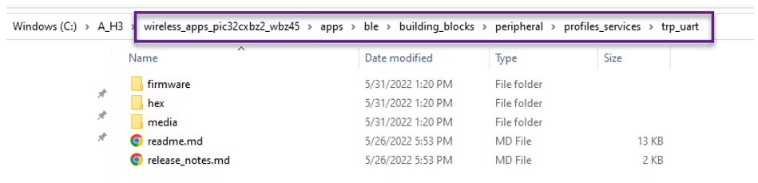

**Step 2** - Setting-up ID for messages

First thing I did was to create a set of new application messages to be used in the to do list.  This is done in *app.h*. I created the message IDs for `APP_MSG_BLE_DISCONNECT`, `APP_MSG_BLE_RX`, `APP_MSG_BLE_TX` and `APP_MSG_TMR_EXP`. See the listing below.

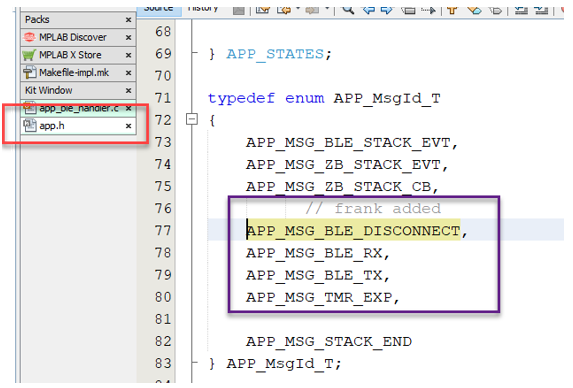

Now we need to write code for each of the events that initiate the messages.

**Step 3** - DISCONNECT and ADVERTISING

First there is BLE DISCONNECT this is  located in the *app_ble_handler.c* file in the `BLE_GAP_EVT_DISCONNETED` case. What we want to do is create a message to the queue that has no data but pushes the `APP_MSG_BLE_DISCONNECT` on to the queue  / todo list.   You can see this in the purple rectangle below. See the listing below.

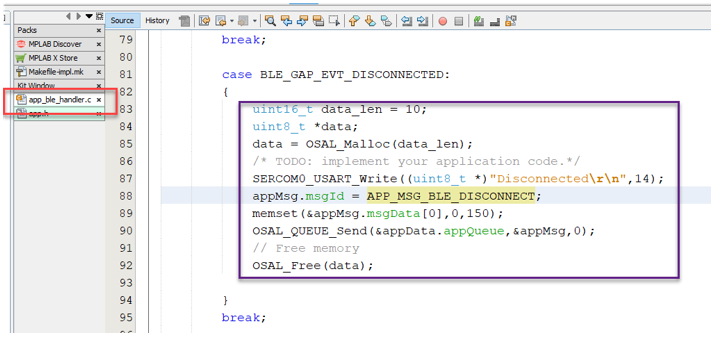

Second we want to take care of this event in the *app.c*. In *app.c* find the app tasks and then the case for `APP_STATE_SERVICE_TASKS`. See listing below.

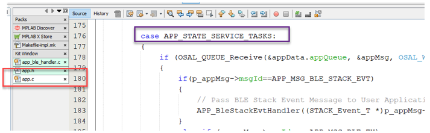

You will need to add another `else if` and check for the `APP_MSG_BLE_DISCONNECT` message we created earlier. In this if statement I write to the console and enable advertisement again. So this way when using the module and you disconnect with the phone the module will start to scan again. See listing below.

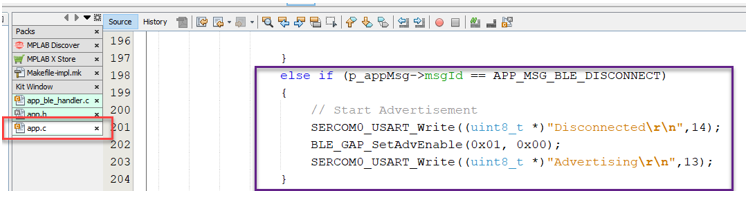

**Step 4** - RECEIVING DATA VIA TRANSPARENT UART

Next we are going to add ability to output BLE received data (this data received by the BLE module typically transmitted by a phone). Goto the file *app_trsps_handler.c* file and find the case for `BLE_TRSPS_EVT_RECEIVE_DATA`.  This is part of the `APP_TrspsEvtHandler` routine. You will need to write `APP_MSG_BLE_RX` ID to `appMsg.msgID`. Read the length of data received, create a temp array for this data. Write the data length into the first element of `appMsg.msgData` Then copy the actual received data to the rest `msgData`. Send all of this information to the Queue. Clear the memory used for Data capture. See listing below. 

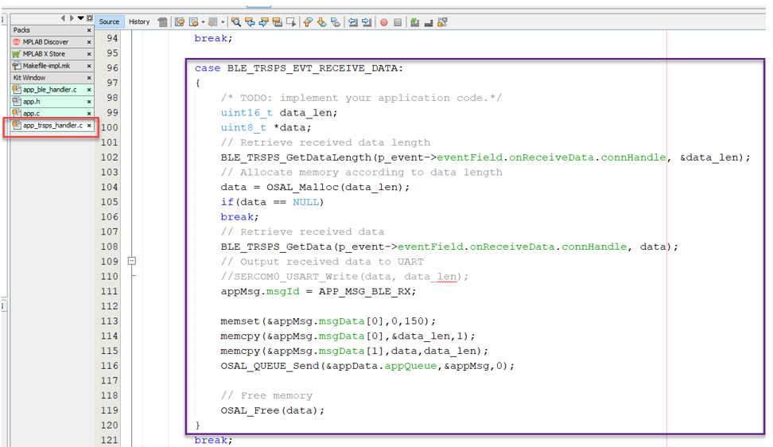

In the `app.c` we will need to do something with the received data. In this case, I simply push it out the serial port. But it would be easy to add some code to Parse/decode the received data and act on it. You will have to add a `else if` in the `APP_STATE_SERVICES_TASKS`. See code below.

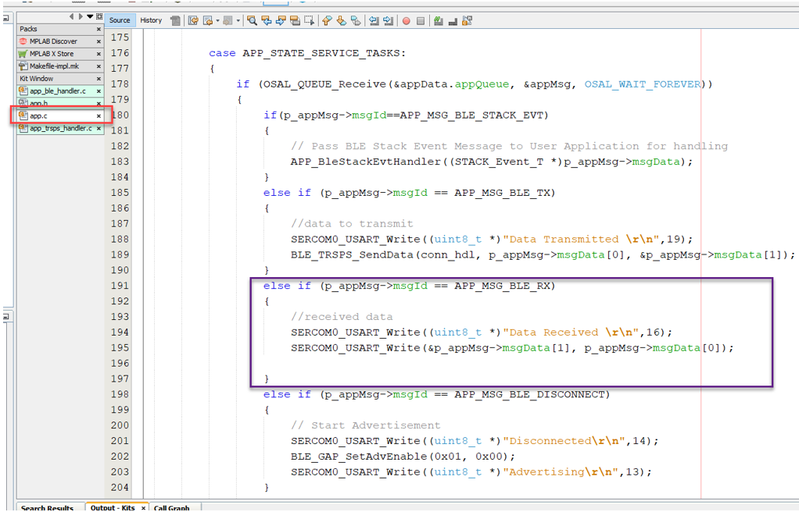

**Step 5** - TRANSMITTING DATA VIA TRANSPARENT UART

The last part of this code will show how to transmit BLE data from the module to the phone. 

As part of UART setup, a UART callback was created. This callback is issued on the reception of each character. In this routine we capture the incoming characters and place them in a array. We test each new character looking for a carriage return. Once a carriage return is received the code will set `appMsg.msgID` with `APP_MSG_BLE_TX`. It will then copy data length to first element of the `appMsg.msgData` and then copy the rest of message to the other elements start from element 1. Lastly it will send `appMsg` to the `appData` queue. See code below.

In the *app.c* file we now need to add to the `APP_STATE_SERVICE_TASKS` state machine.  We can add a `else if` for `APP_MSG_BLE_TX`. In this statement we can use the `BLE_TRSPS_SendData` with a pointer to the data and its data length. See code below. Its easy to see how you can add application data to send that does not come from UART.

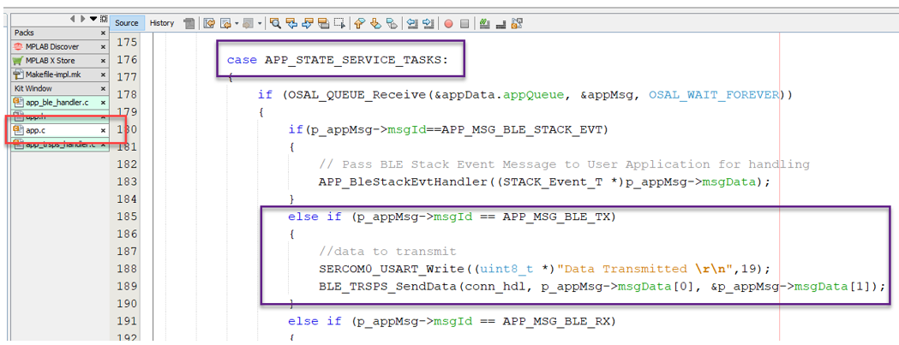

### Part B - Setup Timer and LEDs

In previous project I had setup the transparent UART on the WBZ451 to transmit and receive from WBZ451 over the Curiosity Board UART.

In part B, I am going to add a timer interrupt and send out a periodic message from the WBZ451 module. Also, I am going to setup some LEDs to indicate when I am connected to the module. I will also use the timer interrupt to blink the LEDs at a known rate as well.

**Step 1** - LED Setup

In MCC, in the pin configurator setup PB0, PB3 and PB5 as `RED_LED`, `GREEN_LED` and `BLUE_LED` respectively. 

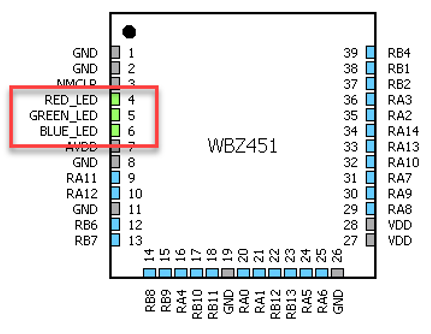

**Step 2** - Timer Setup

In MCC, select TMR3 from peripheral resources and set it up for 1 second period and enable the interrupt.

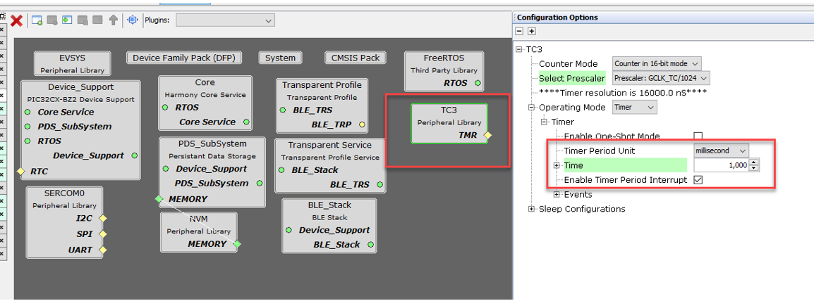

**Step 3** - Generate Code

Hit generate button to have MCC generate the code for new items added via MCC.

**Step 4** - Timer Code

The first set with the timer code is register a call back routine for the timer. This call will be run every time there is a timer interrupt. Also, we will need to start the timer. This code is all in the app initialize routine. The call back routine is named `myTimerCallback` in my program.

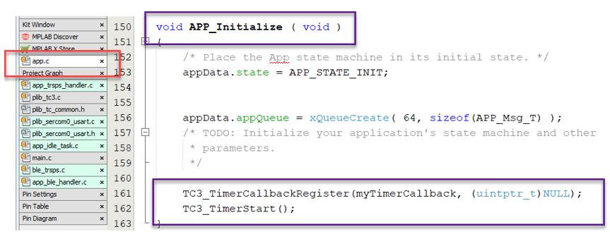

Second part is creating the callback routine. In my application, I only send a message to the queue to indicate that a timer event has happened. Using `OSAL_QUEUE_SendISR` bumps this msg to the top of the queue to be serviced right away.   

*Remark: ensure the `myTimerCallback` function is located in the code prior to the call back register function. No function prototype is needed.*

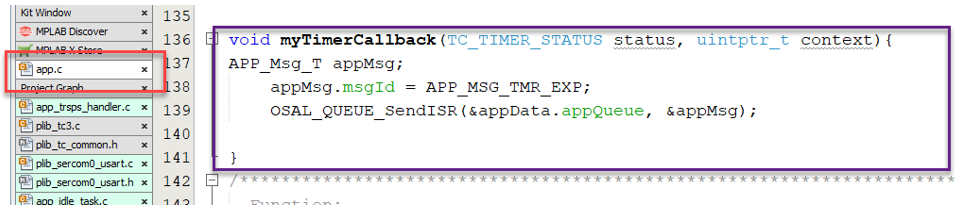

**Step 5** - Application code

We need to add code in the case `APP_STATE_SERVICE_TASKS` of *app.c*. In previous project I added a `else if` for a `APP_MSG_TMR_EXP`, this is where we will add the functionality to transmit periodically and blink the LEDS. I created a string that has a incrementing number in it called `myCounter`, this is so that I can see something changing on the phone when connected. I also added a check to see if the phone is connected. I look at the connection handle `conn_hbl` and if its not NULL then I have a connection. If NULL there is no connection. I blink different color LEDs depending on connection status. Also if connected, I send the string of data over the transparent UART. 

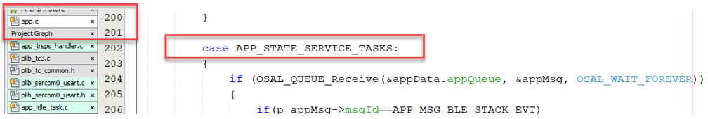
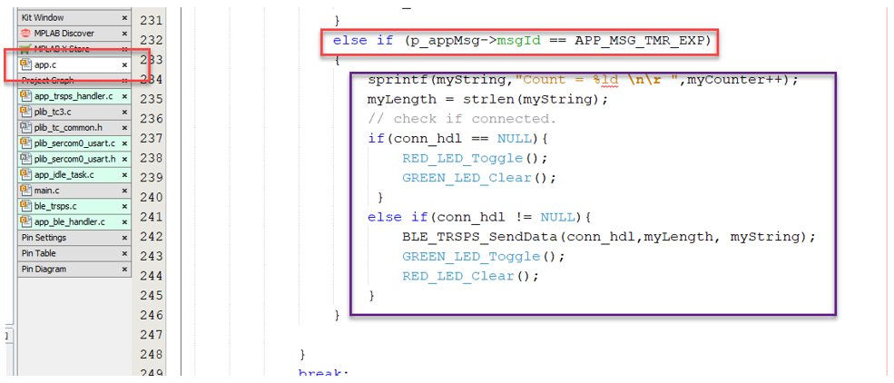

The very last thing I added was in the `else if` of case `APP_STATE_SERVICE_TASKS` of *app.c.*. After outputting the status of a disconnected, I set the `conn_hdl` to NULL.  This ensures the previously discussed routine to check correctly for active connection. 

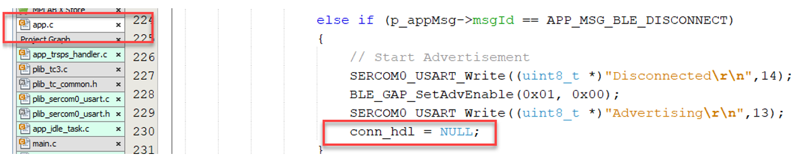

### Part C - Setup Sensor Interface

In previous projects, I setup the transparent UART and a timer. In part C, I am going to a Thermo 8 click which has the MCP9808 temperature sensor and will measure and transmit temperature periodically once connected.

**Step 1** - Pin Setup

In MCC, in the pin configurator setup PA14 and PA13 as sercom2_pad1 and pad 0 respectively.

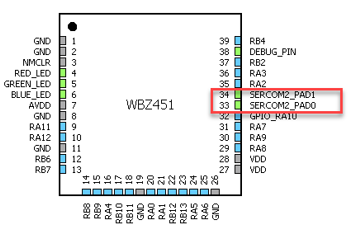

**Step 2** - I2C Peripheral Setup

In MCC Project Graph, in the configuration options of System, select DEVCFG1 and change Sercom2 fuse bit to DIRECT. If left in PPS the I2C will not be routed to the appropriate default pins.

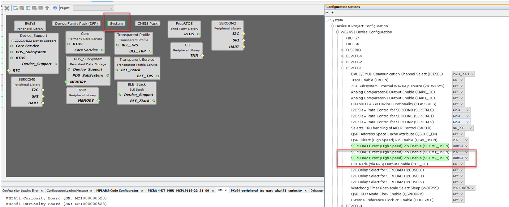

In MCC, add SERCOM2 from peripheral resources and set it up as I2C Master.

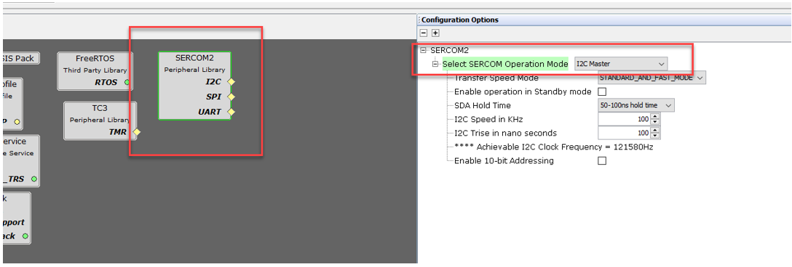

**Step 3** - Generate Code

Hit generate button to have MCC generate the code for new items added via MCC.

**Step 4** - I2C Code

If needed, you can add a callback routine to monitor successful or faulted I2C tasks. The callback routine is named `SERCOM2_I2C_Callback` in my program.

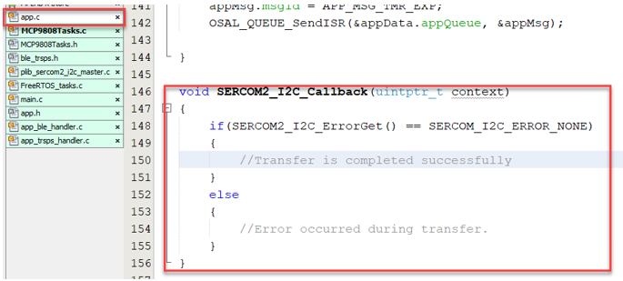

Ensure you register the callback in the `APP_Initialize` function.

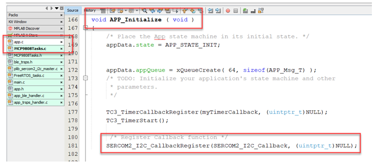

**Step 5** - Application Code

I now added a routine to read the temperature from the MCP9808 and convert the read value into degrees C. I truncated the temperature to a resolution to 1 degree. Using the `SERCOM2_I2C_WriteRead` PLIB function I read register 0x05 and 0x06 from the MCP9808 which gives an ambient temperature. The value is only 12 bits which code lines 6,7,8,9 scale and convert temperature value.

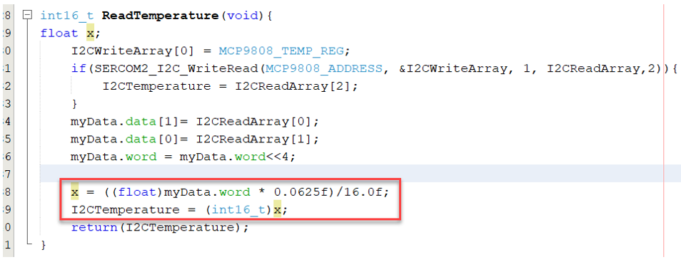

We need to add code in switch case: `APP_STATE_SERVICE_TASKS` of state of the *app.c* file.

When the timer expires, I read temperature into `myTemp` variable, create a string that states the temperature. If the WBZ451 is connected to a phone, then I call the `BLE_TRSPS_SendData` routine we defined in previous project.
This setup can be used for any sort of periodic sensor measurement.

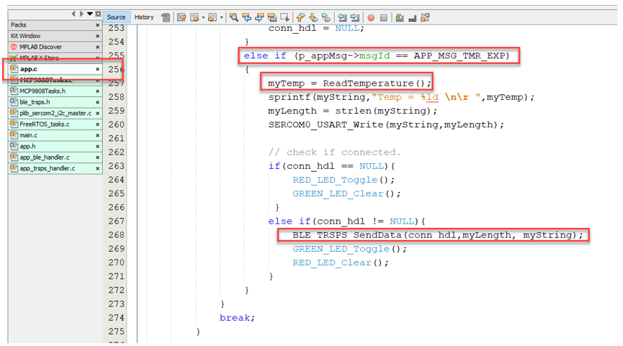

### Part D - Finalize Application Code

Last update to the temperature project. In this code I wanted to turn ON and OFF the temperature sampling timer.

**Step 1** - Add new app message

First we add a new app message to the already existing list of app messages defined in *app.h*. In this case I added `APP_MSG_BLE_CONNECTED`.

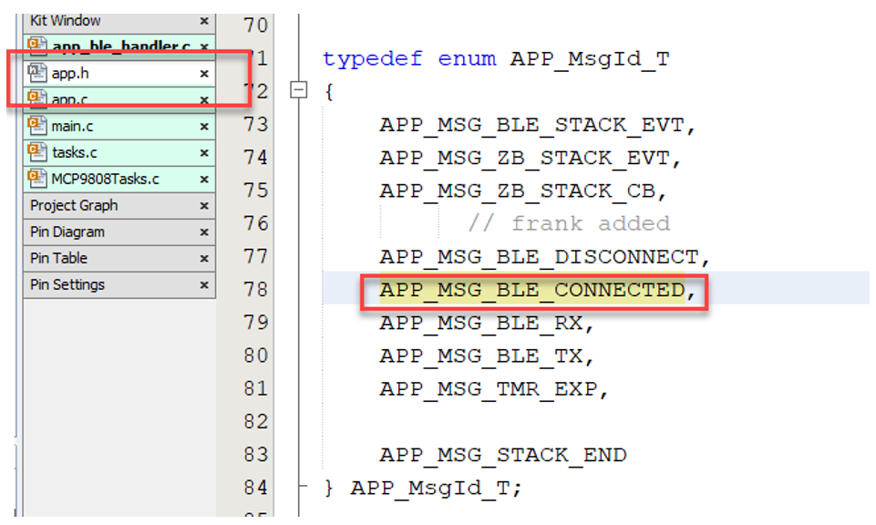

**Step 2** - Add mesage to the queue

I added code to the *app_ble_hander.c* to push a message onto the queue to indicate a BLE connection has been made.

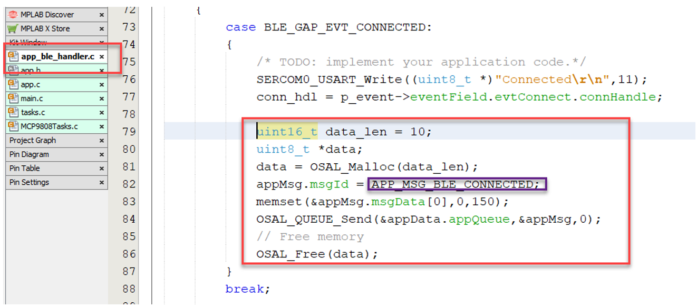

**Step 3** - Application Code

The last part of the code that I changed was in *app.c* in `APP_STATE_SERVICE_TASKS`. 

I added a `else if` condition to look for the `APP_MSG_BLE_CONNECTED` where I clear the RED LED and start  timer 3 which creates the `APP_MSG_TMR_EXP` message.

In the case of a DISCONNECT, I now turn on RED LED, clear the GREEN LED and stop timer 3.

Lastly in the `APP_MSG_TMR_EXP` if statement, I toggle the  green LED, measure temperature and transmit the data.

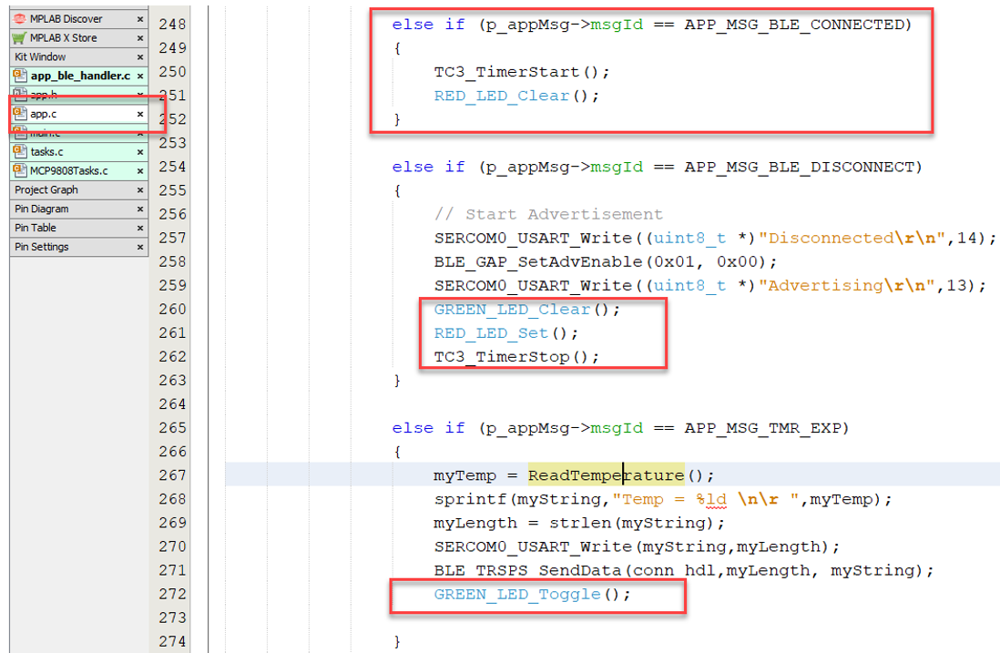

## Smartphone Application

## Run the demo

<a href="#top">Back to top</a>